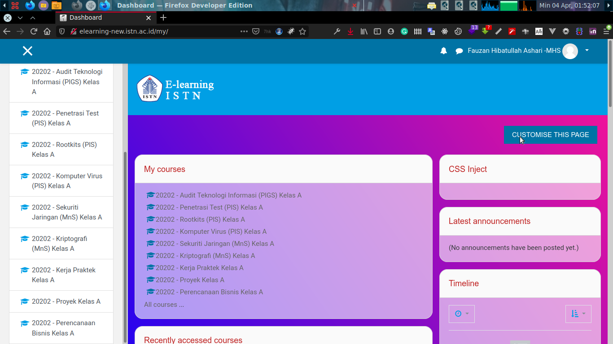
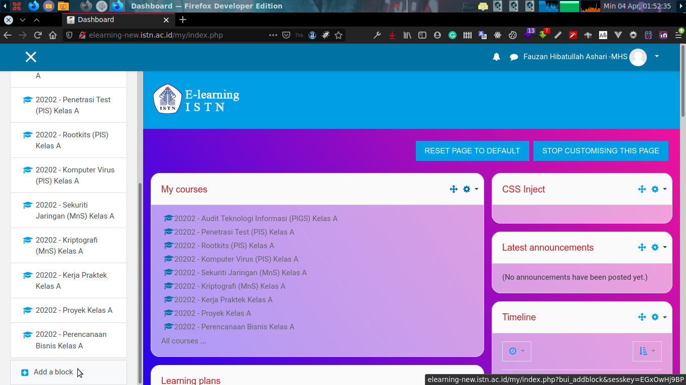
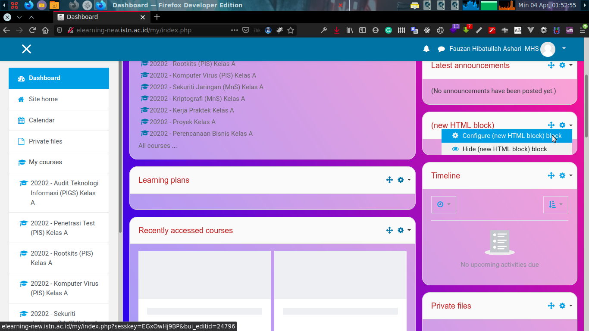
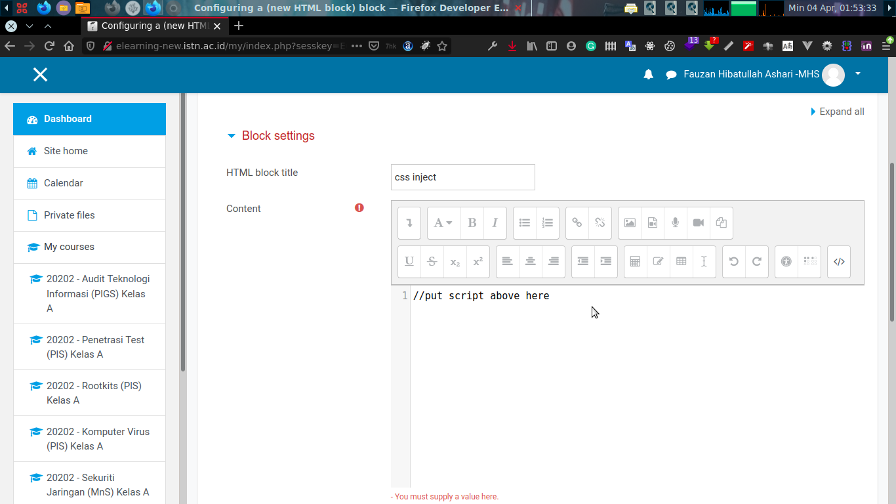

1. Login to your moodle e-learning
   
2. In dashboard page click **Customize this page**

1. Click **add a block** at bottom left sidebar and choose **HTML** block

4. **HTML** is added, go configure it

5. Put script above **moodle-css-inject.js** in the textbox and save it

6. 🤖 poof you did it